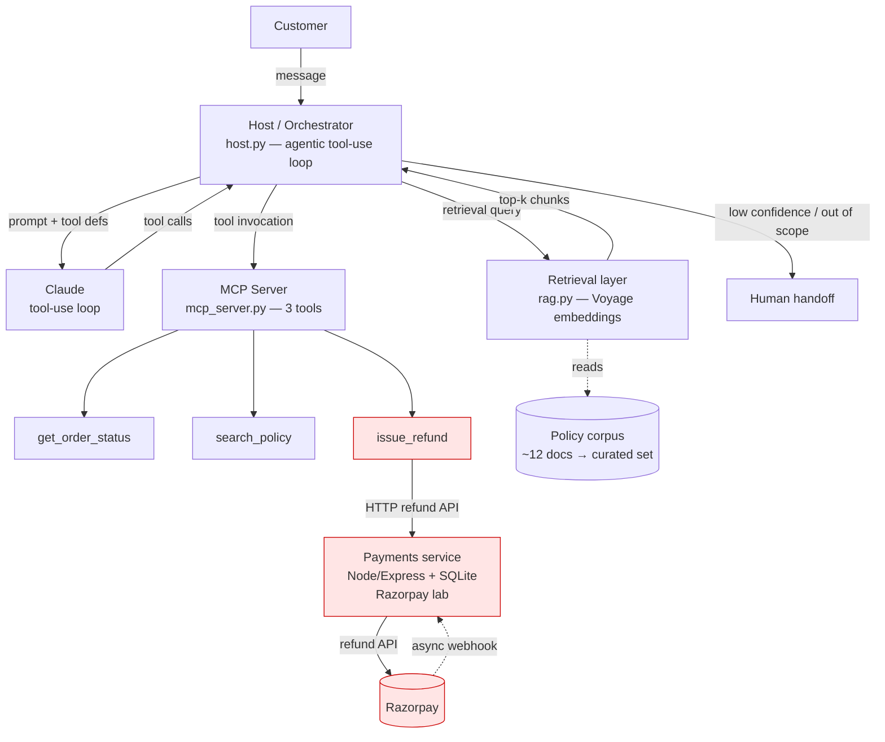
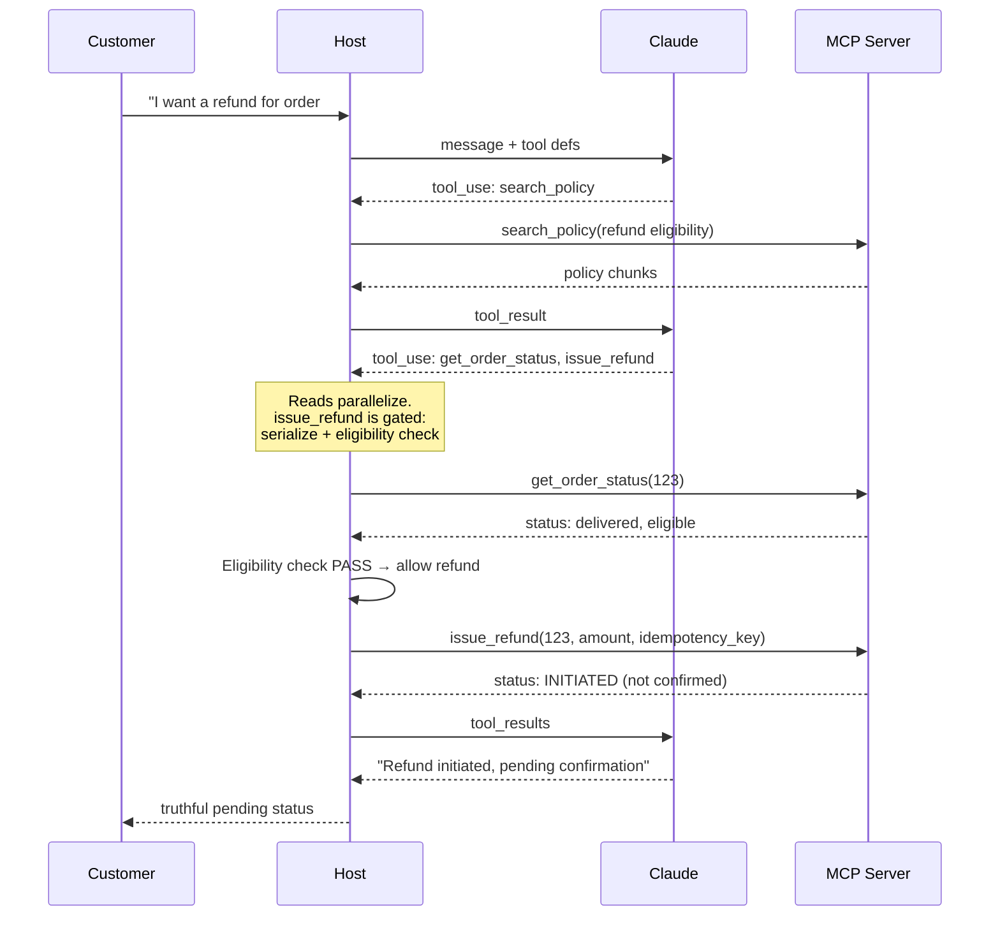
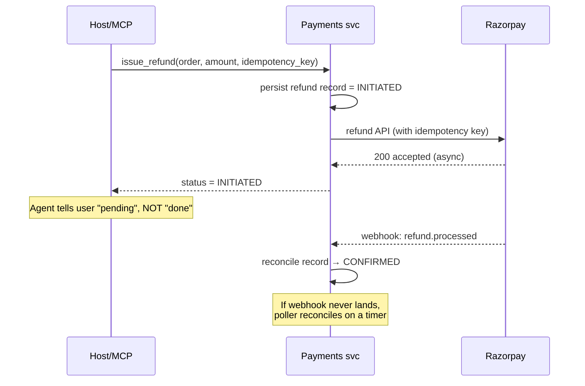
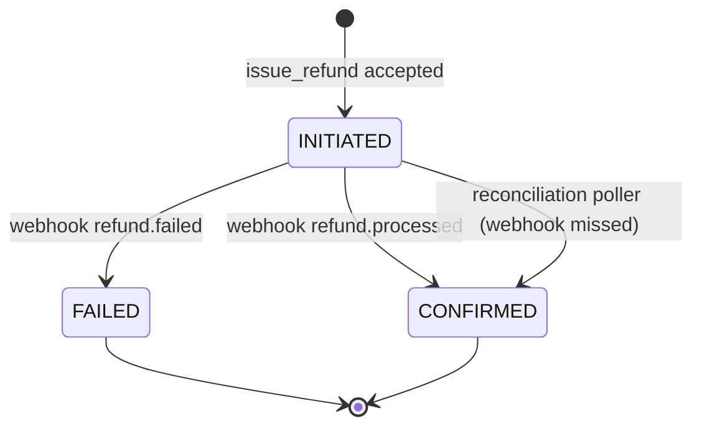

# System Design — Policy-Aware Support Agent (Demo 01: Agentic RAG over MCP)

**Repo:** `github.com/ktajpuri/ai-agent-demos` · **Scope:** Demo 01 — agentic RAG over MCP with a real Razorpay refund path
**Positioning of this document:** how this demo would go to production for a mid-market Indian D2C / marketplace support org. The scale target is deliberately *realistic*, and the first finding below is that the obvious "scale problem" framing is wrong for this system.

---

## 0. The honest headline (read this before the rest)

This is **not a throughput system.** When you run the scale math (§1), average load lands around **0.03 conversations/second**, peaking near 0.3/s on a sale day. A single modern application server handles that without breaking a sweat. If you walk into a design review and start talking about sharding, horizontal autoscaling, and QPS, you are solving a problem this system does not have.

The problem this system actually has is **correctness and blast radius.** It is an autonomous agent that *moves money* (issues refunds via Razorpay) and *makes factual claims about policy* to customers. Every failure mode worth designing against in Demo 01's nine-scenario matrix was a **system-design failure, not a model-capability failure** — silent retrieval misses, parallel tool calls widening blast radius, an async webhook gap that let the agent report a refund as done before it was confirmed, missing idempotency, and policy contradictions surfaced verbatim to users.

So the whole document is organized around that: **the rate of money-moving actions and the cost of a wrong autonomous action are the real scale axes, not requests per second.**

---

## 1. Requirements and Scale Assumptions

### 1.1 Functional requirements

| # | Requirement | Notes |
|---|---|---|
| F1 | Answer customer policy questions (returns, refunds, shipping, cancellation windows) grounded in a curated policy corpus | RAG, not parametric knowledge |
| F2 | Take bounded actions on the user's behalf: check order status, initiate refund/return | Side-effecting; money movement |
| F3 | Escalate to a human when confidence is low or the request is out of scope | The default, not the exception |
| F4 | Report action status truthfully, including "in progress / pending confirmation" states | Directly from Scenario 9 |

### 1.2 Non-functional requirements (ranked by what actually matters here)

1. **Correctness of money-moving actions** — no double refunds, no over-refunds, no refunds the user wasn't eligible for. This is the top constraint.
2. **Truthful state reporting** — never claim an action succeeded before it's confirmed.
3. **Grounded answers** — never answer a policy question from the model's parametric memory when retrieval returns nothing relevant.
4. **Graceful degradation** — when a tool, the payment provider, or retrieval fails, the agent escalates cleanly rather than improvising.
5. Latency — a few seconds end-to-end is fine for support; this is not latency-critical.
6. Throughput — effectively a non-requirement at this scale (proven below).

### 1.3 Scale math (the part that deflates the premise)

Assumed company profile: mid-market Indian D2C / marketplace.

| Driver | Assumption | Value |
|---|---|---|
| Orders | 1,000,000 / month | ≈ 33,000 / day |
| Support contact rate | 7% of orders generate a contact | ≈ 2,300 contacts / day |
| Agent-addressable share | ~50% are policy Q&A + order-status + refund/return (the rest are out-of-scope: payments disputes, fraud, human-only) | ≈ **1,150 conversations / day reach the agent** |
| Target containment | 60% resolved without a human | ≈ 690 auto-resolved/day · ≈ 460 escalated/day |
| **Refund actions** | ~25% of agent conversations trigger a refund/return | **≈ 290 refund attempts / day** |

Now the throughput check:

```
1,150 conversations/day ÷ 10 active hours ÷ 3,600 s
  = 0.032 conversations/second (average)

Sale-day peak (assume 10×)        ≈ 0.32 conversations/second
LLM calls per conversation (~4)   ≈ 1.3 model calls/second at peak
```

**Conclusion: peak load is ~1 QPS of model calls.** Throughput is not a design problem. The number that *is* worth obsessing over is **~290 money-moving actions/day** — because the cost of getting one of those wrong dwarfs everything else in this system.

> **Open question (flag, don't paper over):** the 7% contact rate and 50% addressable share are typical-but-assumed. If real data shows the addressable share is much lower (e.g., most contacts are out-of-scope disputes), the agent's ROI case weakens and the right call may be a narrower scope. Validate against actual support-ticket taxonomy before committing.

---

## 2. High-Level Architecture

**Diagram 1 — System overview**



The red path is the money-moving surface. Everything in §4–§6 exists to keep that path safe.

---

## 3. Component Design

### 3.1 Host / Orchestrator (`host.py`)

**What it does:** runs the explicit Anthropic tool-use loop — sends the user message plus tool definitions to Claude, executes returned tool calls, feeds results back, and repeats until the model produces a final answer.

**Why it's built this way (and not on a framework):** the explicit loop was a deliberate choice over LangGraph / CrewAI / LlamaIndex. For a system whose dominant risk is *blast radius of autonomous actions*, framework opacity is a liability — you need to see and gate every tool call. The trade-off is real: you write orchestration plumbing yourself instead of getting it free. At this scale that's the right trade; the plumbing is small and the visibility is worth more than the saved code.

**Where it breaks (observed):** **parallel tool calls increase blast radius.** When the model emits multiple tool calls in one turn, side-effecting ones (`issue_refund`) can fire concurrently or alongside reads, widening the surface for a wrong action.

**Mitigation:** partition tools into *read* and *side-effecting*. Reads may parallelize freely. Side-effecting tools are **serialized and gated** — at most one in flight, each preceded by a server-side eligibility check (§5). This is the single most important control in the system.

**Diagram 2 — Agentic loop with the side-effect gate**



### 3.2 Retrieval layer (`rag.py`)

**What it does:** embeds the user query with Voyage AI, retrieves top-k chunks from the policy corpus, hands them to the host as grounding context.

**Where it breaks (observed):** **silent retrieval misses** — the query embeds, retrieval returns *something* (nearest neighbors always exist), but nothing is actually relevant, and the agent answers anyway from parametric knowledge. This is the most dangerous RAG failure because it's invisible.

**Mitigation:** a **retrieval-confidence threshold.** If the top result's similarity is below a tuned floor, treat it as "no relevant policy found" → the agent must say it doesn't know and escalate, never improvise a policy answer. Tune the floor against a labeled set of in-corpus and out-of-corpus queries; accept that this trades some auto-resolution for correctness. For a system making policy claims to customers, that trade is correct.

**Honest scale note on the vector store:** the corpus is ~12 docs, growing to maybe a few hundred in production. **This does not justify a managed vector DB.** In-memory or `pgvector` on the existing Postgres is sufficient and removes an entire piece of infrastructure. Reach for Pinecone/Qdrant only past ~10⁵–10⁶ chunks or when you need filtered hybrid search at scale. Adding a vector DB here would be resume-driven architecture, not problem-driven.

### 3.3 MCP Server (`mcp_server.py`) and the three tools

Exposes `get_order_status`, `search_policy`, `issue_refund`. The first two are reads. `issue_refund` is the money-moving tool and gets the eligibility gate, idempotency key, and serialization described above and in §5.

### 3.4 Payments path and the webhook reconciliation gap

**The observed failure (Scenario 9):** the agent calls `issue_refund` → Razorpay returns "initiated" → but the *confirmed* status arrives asynchronously via webhook 4–5 seconds later. In between, order status lags and a naive implementation would report "refund successful" before it actually is.

**Mitigation — never conflate "initiated" with "confirmed":**

**Diagram 3 — Refund with reconciliation**



**Diagram 4 — Refund state machine**



The poller is the backstop for the observed gap that silent-webhook failures don't get stuck in INITIATED forever. (This mirrors the silent-webhook observability defect you already caught in the Razorpay lab — same class of bug, designed out here.)

---

## 4. Observed Failures → Mitigations (the core table)

Every row traces to a *real* scenario from the nine-scenario matrix, not a generic best-practice checklist. This table is the heart of the document.

| # | Observed failure | Root cause | Mitigation | Trade-off accepted |
|---|---|---|---|---|
| 1 | Parallel tool calls widen blast radius | Concurrent side-effecting calls | Serialize + gate side-effecting tools; reads parallelize | Slightly slower multi-action turns |
| 2 | Silent retrieval miss → improvised policy answer | No relevance floor on retrieval | Confidence threshold → escalate on miss | Lower auto-resolution rate |
| 3 | Policy contradictions surfaced to user | Conflicting docs in corpus | Corpus curation + conflict detection + single source of truth | Editorial overhead on corpus |
| 4 | Rate limits hit under burst | No backoff/queue | Exponential backoff w/ jitter + request queue | Added latency under load |
| 5 | No idempotency on refunds | Refund API called without dedup key | Idempotency key per refund; server-side dedup | None meaningful |
| 6 | "Refund done" reported before confirmed | Async webhook treated as sync | INITIATED vs CONFIRMED states + reconciliation poller | User sees "pending" briefly |

If I had one slide for an interview, it would be this table — it's the difference between "I built a RAG demo" and "I ran an autonomous money-moving agent and characterized its failure surface."

---

## 5. Security / Threat Model (money movement is the domain risk)

Generic LLM-security checklists are weak here. The specific risk is: **an autonomous agent that can move money, driven by untrusted user text.**

| Threat | Vector | Control |
|---|---|---|
| Prompt injection → unauthorized refund | User message instructs the agent to refund | Refund eligibility + amount decided **server-side from the order record**, never from agent/user-supplied values. The agent *requests*; the payments service *authorizes*. |
| Over-refund / double-refund | Repeated or inflated refund call | Idempotency keys; server-side cap at original paid amount; one-refund-per-order-line invariant |
| Refund to ineligible order | Agent misreads policy | Eligibility check in payments service is the source of truth, independent of the agent's reasoning |
| Policy corpus poisoning | Tampered doc → wrong customer-facing policy | Corpus write access controlled + reviewed; treat the corpus as production config |
| PII leakage | Order/customer data in prompts and logs | Redact PII from logs; minimize PII in retrieved context; scoped data access per conversation |

**The load-bearing principle:** the agent is never the authority on whether or how much to refund. It proposes; a deterministic server-side check disposes. This makes prompt injection an annoyance rather than a financial incident.

---

## 6. Cost Analysis

**Pricing flagged as illustrative — verify against current published rates before quoting in a review.** Figures used: Claude Sonnet ≈ \$3 / M input, \$15 / M output; Voyage embeddings ≈ \$0.06 / M tokens. These are order-of-magnitude, not committed numbers.

| Component | Volume/day | Unit (est.) | Daily (est.) | Monthly (est.) |
|---|---|---|---|---|
| LLM inference | 1,150 conv × ~15K in + ~2K out tokens | ~\$0.075 / conv | ≈ \$86 | ≈ **\$2,600** |
| Query embeddings | 1,150 × ~200 tokens | negligible | < \$0.10 | < \$5 |
| Vector store | in-memory / pgvector | — | \$0 incremental | \$0 |
| Payments | refund API | no per-refund fee | — | — |

**The honest cost story:** at this scale **inference is ~\$2.6K/month — and that is not where cost concentrates.** The real cost is **human escalation labor** (~460 escalations/day × handling time) and **refund risk** (one wrong autonomous refund can cost more than a month of inference, plus trust damage). Optimizing token cost here would be premature optimization of the cheap thing.

**Cost levers, in priority order — but note most are premature:**
1. *Reduce escalation rate* via better retrieval/containment — biggest real lever, attacks the dominant cost.
2. *Route simple classification to Haiku, reserve Sonnet for synthesis* — would cut inference materially, but inference isn't the bottleneck, so this is a "later" optimization.
3. *Cache embeddings for repeated queries* — marginal at this volume.

Do #1. Defer #2 and #3 until there's a reason.

---

## 7. Monitoring and Observability

Grouped by audience.

**Business health:** auto-resolution (containment) rate · escalation rate · refund volume & value/day · CSAT on agent-handled conversations.

**System health:** tool-call latency & error rate · retrieval latency · LLM error/rate-limit rate · payments-API error rate.

**Correctness (the ones that matter most, and the hardest to measure):**
- Retrieval-miss rate (queries below confidence floor)
- Refund reconciliation lag (INITIATED → CONFIRMED time; the Scenario-9 metric)
- Stuck-refund count (INITIATED beyond SLA → poller should have caught it)
- Policy-contradiction flags raised
- **Hallucinated-policy-answer rate** — *open question:* genuinely hard to measure automatically. Candidate approach: sampled human review + an LLM-judge cross-check against retrieved chunks. Flag this as unsolved rather than pretending a dashboard covers it.

**Tiered alerts:**

| Alert | Threshold | Severity |
|---|---|---|
| Refund volume spike (possible bug/fraud) | > 3× baseline/hour | **P1 — page** |
| Refund stuck in INITIATED | > 60s | **P1 — page** |
| Reconciliation lag rising | p95 > 30s | P2 |
| Retrieval-miss rate spike | > 2× baseline | P2 |
| LLM rate-limit errors | sustained > 1% | P3 |

The two P1s both guard money. That's the right priority ordering for this system.

---

## 8. Appendix — Tools, Products, and Rationale

Every choice shows alternatives, so each reads as a decision, not a recommendation.

| Category | Chosen | Role | Why | Alternatives |
|---|---|---|---|---|
| Orchestration | Explicit Anthropic tool-use loop | Agentic control flow | Full visibility/control over every tool call; critical when blast radius is the top risk | LangGraph, CrewAI, LlamaIndex agents — more built-in machinery, less transparency |
| Tool protocol | MCP | Tool exposure / interop | Clean tool boundary, reusable across hosts, decouples tools from orchestrator | Direct function calling (simpler, less portable); OpenAPI plugins |
| Embeddings | Voyage AI | Semantic retrieval | Strong retrieval quality; already integrated | OpenAI `text-embedding-3`, Cohere Embed, open `bge`/`e5` (self-host) |
| Vector store | In-memory / pgvector | Policy retrieval | Corpus is tiny; no managed DB justified | Pinecone, Qdrant, Weaviate — warranted only at 10⁵–10⁶+ chunks |
| LLM | Claude Sonnet | Reasoning + synthesis | Quality at acceptable cost for this volume | Haiku (cheaper, for routing/classification); Opus (overkill here) |
| Payments | Razorpay | Refund execution | India-native, already integrated in the lab | Stripe (broader intl; less India-optimized) |
| Datastore | SQLite (lab) → Postgres | Order + refund state | Lab uses SQLite; Postgres for prod (pgvector doubles as vector store) | MySQL; managed RDS/Cloud SQL |

---

## 9. What this design deliberately does NOT do

- **No horizontal scaling story.** Proven unnecessary in §1. Adding it would be solving an imaginary problem.
- **No managed vector DB.** Corpus size doesn't justify it.
- **No multi-region / HA architecture.** Out of scope at this scale; revisit if the addressable volume is 20× larger.
- **No fine-tuning.** Retrieval + a good base model covers the requirement; fine-tuning would be premature.

If the scale assumptions in §1 turn out 10–20× larger after validation, the things that change are the human-escalation operating model and possibly the datastore — *not* the agent core. The agent core is correctness-bound, not throughput-bound, and that doesn't change with volume.
